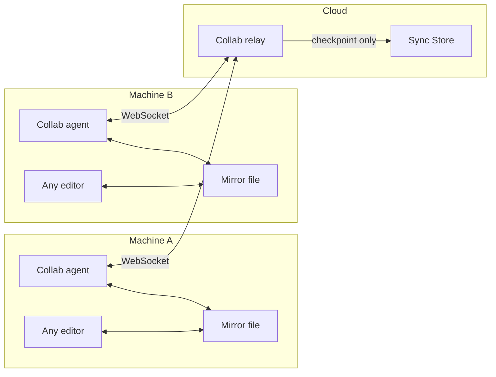

# Live Collaboration

Kitchen supports **live collab** — simultaneous pair editing on one file — via an ephemeral **Collab relay** and per-machine **Collab agents**. Durable history still flows through insert-only **Versions** at **Checkpoint** boundaries.

## Layer diagram



Voice coordination (Discord, Meet, phone) is external. Kitchen syncs file bytes only.

## Components

| Component | Owns | Persists? |
|-----------|------|-----------|
| **Sync Store** | users, roles, files, versions | Yes |
| **Collab relay** | sessions, presence, op log | No (ephemeral; TTL on idle) |
| **Collab agent** | mirror watch ↔ relay ops per machine | No |
| **Collab adapters** (optional) | in-editor presence plugins | No |

**v0:** editor-agnostic pair via **Collab agent**. No browser, no required plugins.

## Live sync vs live collab

| | Live sync | Live collab |
|---|-----------|-------------|
| Latency | Seconds | Sub-second ops (autowrite-dependent on mirror) |
| Durability | Every `version.insert` | **Checkpoint** only |
| Channel | Project subscription | Collab relay namespace |
| Typical trigger | Solo save, checkpoint complete | `collab.applyOp` stream |

## Collab session lifecycle

```
1. User A runs kitchen pair start <file> (requires write on File)
2. Relay creates session { sessionId, fileId, baseVersionId, participants: [A] }
3. User B runs kitchen pair join <sessionId>
4. Collab agents on both machines connect; mirror files seeded from base version
5. Ops broadcast: op.replace with session sequence numbers (full-file or patch)
6. Presence broadcast: cursor line/col, selection (optional v0)
7. Checkpoint → versions.insert(mergedBuffer) on: manual, debounce (30s), session end
8. version.insert + file.pointer fan out (existing live sync)
9. Session ends or idles out (4h TTL)
```

## Checkpoint rules

- **One checkpoint ≠ one keystroke.** Default debounce 10–30s or explicit save.
- Checkpoint content = relay's authoritative session buffer.
- `baseVersionId` must equal `currentVersionId` at session start.
- External `version.insert` during session → `session.stale`; rebase or end session.
- Two checkpoints from same session without external fork → linear history.
- Checkpoint during external concurrent edit → may fork; **Pierre Merge** unchanged.

## Editor-agnostic participation (v0)

```
┌──────────┐  read/write   ┌──────────────┐  WebSocket   ┌─────────────┐
│ Any      │◄─────────────►│ Collab agent │◄────────────►│ Collab relay│
│ editor   │  mirror file  │ (background) │              │   (cloud)   │
└──────────┘               └──────────────┘              └──────┬──────┘
  nvim, VS Code, Zed…                                            │ checkpoint
                                                                 ▼
                                                          versions.insert
```

| Participant | Path | Notes |
|-------------|------|-------|
| Any mirror editor | Collab agent watches file → ops | Enable autowrite/autosave |
| Web (optional) | Direct relay binding | No mirror |
| Optional plugin | localhost → agent | In-editor cursors; plan 011 |

**During active session on file F:** mirror changes → `collab.applyOp`; solo `versions.insert` is **redirected** to the agent path. Remote ops write mirror with echo suppression.

## Authorization

- Start/join session: same `canWrite(user, file)` as `versions.insert`.
- Observe-only (optional): users with `read` may watch session buffer without emitting ops.

## Collab API (ephemeral — not tables)

No `collab_sessions` table in the Sync Store. Relay storage is implementation-specific.

| Call | Behavior |
|------|----------|
| `collab.startSession(fileId)` | Returns sessionId; validates write |
| `collab.joinSession(sessionId)` | Adds participant |
| `collab.leaveSession(sessionId)` | Removes participant; may checkpoint |
| `collab.applyOp(sessionId, op)` | Broadcast; relay orders |
| `collab.updatePresence(sessionId, presence)` | Broadcast only |
| `collab.checkpoint(sessionId)` | `versions.insert`; may continue or end session |

Collab events use a **separate WebSocket channel** from project subscription. See [Event Catalog](../reference/event-catalog.md).

## Not in scope

- Voice, video, text chat
- Terminal/shell sharing
- Multi-file sessions (v0: one file per session)
- Binary line-merge (binary = observe-only v0)

## Open questions

| Question | Lean for v0 |
|----------|-------------|
| OT vs CRDT | Yjs update blobs as default spike |
| Max session duration | 4h idle TTL |
| Hub transport | Unix socket macOS/Linux; named pipe Windows |

## Related

- [Collab Agent](../clients/collab-agent.md)
- [Sync Model](../concepts/sync-model.md)
- [Versioning](./versioning.md)
- [Schema](../concepts/schema.md)