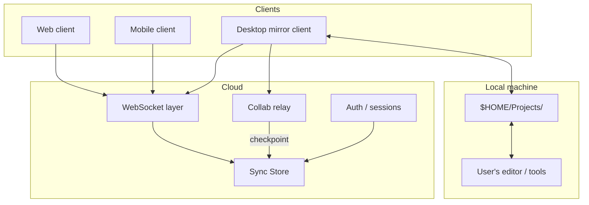

# Architecture Overview

Kitchen has a deliberately small architecture: **users**, **roles**, and **files** (with append-only versions). Three client surfaces talk to one Sync Store over WebSockets.

## System diagram



## Data flow: save a file

```
1. User saves in editor
2. Desktop client filesystem watcher fires
3. Client reads bytes from mirror path
4. Client calls version.insert(fileId, content)
5. Sync Store persists row, broadcasts version.insert
6. Other clients receive event
7. Peer desktop clients write to their mirror paths
8. Web/mobile clients update in-memory view
```

No commit object. No push command. The insert **is** the event.

## Data flow: concurrent edit

```
1. User A and User B both insert versions from v1
2. Sync Store holds v1, v2a, v2b
3. Current pointer enters "forked" state
4. Either user opens Pierre Merge
5. Merged content inserts as v3
6. Pointer advances to v3
7. Mirror clients sync v3
```

## Data flow: pair programming checkpoint

```
1. Alice and Bob join collab session via Collab agents
2. Edits flow as op.apply over collab relay (not version.insert)
3. Agents keep mirrors in sync with echo suppression
4. Checkpoint triggered (debounce or explicit)
5. Relay calls versions.insert with session buffer
6. Sync Store broadcasts version.insert (live sync)
7. Non-participant clients receive update normally
```

## Layer responsibilities

| Layer | Owns |
|-------|------|
| **Sync Store** | Persistence, authorization, version insert, subscriptions |
| **Collab relay** | Ephemeral sessions, ops, presence; checkpoint → Sync Store |
| **WebSocket layer** | Fan-out, session affinity, reconnection |
| **Desktop client** | Mirror read/write, **Collab agent**, echo suppression |
| **Web client** | Project browser, editor (optional), merge UI |
| **Mobile client** | Read-heavy access, light edits |

## What Kitchen is not building (v0)

- Custom VCS algorithms (merge drivers, diff3)
- Server-side filesystem
- IDE language services
- CI/CD orchestration (consumers may watch version inserts later)

## Technology stance

| Component | Status |
|-----------|--------|
| Sync Store | Open — Convex is reference implementation |
| Diff/merge UI | Pierre primitives, fork if blocked |
| Desktop shell | Open — Electron is a candidate |
| Auth | Standard session/OAuth — unspecified |

## Deployment shape (conceptual)

```
                    ┌─────────────────┐
                    │  API + WS edge  │
                    └────────┬────────┘
                             │
              ┌──────────────┼──────────────┐
              ▼              ▼              ▼
         users table    roles table    files + versions
```

Exact schema: [Data Model](./data-model.md).

## Related

- [Data Model](./data-model.md)
- [Versioning](./versioning.md)
- [Sync Model](../concepts/sync-model.md)
- [Live Collaboration](./live-collaboration.md)
- [Client Overview](../clients/overview.md)