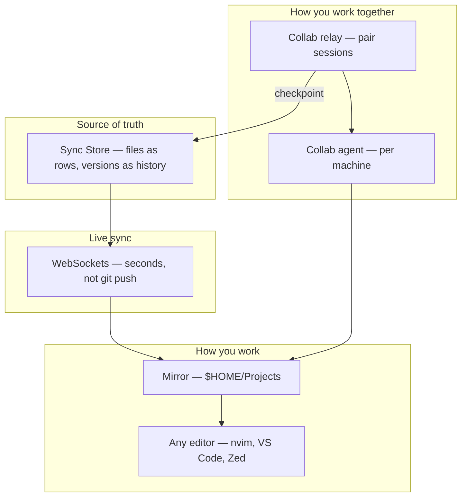

# The Kitchen Way

Kitchen is a different way to store, sync, work on, and collaborate on code. This page is the **onboarding hub** — read it before diving into architecture details.

**Time:** ~15 minutes. **Next:** [Getting Started](./getting-started.md) for invariants, then [Three Modes of Work](./concepts/three-modes-of-work.md).

## The problem with today

Most developers stack four separate systems:

```
Editor (local)  →  Files on disk  →  Git  →  Remote hosting
                         ↑
              "source of truth" (informally)
```

Collaboration is **async**: branch, commit, push, open PR, wait, review, merge. Realtime editing exists for Google Docs — not for your repo. Pair programming means screen share or specialized IDE extensions.

Kitchen asks: **what if the cloud held the truth, your disk was a live view, and collaboration matched how you actually work?**

## One stack, four layers

Kitchen collapses storage, sync, solo work, and collaboration into one model:



| Layer | Kitchen idea | You experience |
|-------|--------------|----------------|
| **Storage** | Files are database rows; content is version rows | History without `git commit` |
| **Sync** | WebSocket push to every device | Save → peers see it in seconds |
| **Work** | Mirror at `$HOME/Projects` | Your normal editor and terminal |
| **Collaboration** | Live collab + Pierre Merge | Pair in any editor; merge by line-pick |

## What makes it novel

### 1. Storage is not a filesystem (server-side)

A `File` is a row. A folder is a `dir` row. An org and a project are `dir` rows with parent rules. Content lives in append-only **Version** rows — never overwritten.

This is closer to **event sourcing per file** than to git objects or a server filesystem. See [Files and Versions](./concepts/files-and-versions.md).

### 2. Your disk is a mirror, not the authority

`$HOME/Projects/my-app` exists because the **desktop client** wrote it. Delete the folder; it rebuilds from subscriptions. The **Sync Store** is authoritative.

Like Google Drive Desktop — but for code, with full version history as queryable rows. See [Sync Model](./concepts/sync-model.md).

### 3. Work is editor-agnostic

Kitchen is **not** an IDE. It does not host LSP, terminals, or previews. You keep nvim, VS Code, Xcode, `make`, `cargo test` — everything that reads the mirror path.

### 4. Collaboration has three modes

Not one workflow — three, depending on what you're doing:

| Mode | When | Mechanism |
|------|------|-----------|
| **Solo live sync** | You alone, saving normally | Save → `versions.insert` → mirror on other devices |
| **Async concurrent** | Two people save without pairing | Two version heads → fork → **Pierre Merge** |
| **Live collab** | Pair programming | **Collab agent** + relay → **checkpoint** → version |

Details: [Three Modes of Work](./concepts/three-modes-of-work.md).

Voice and video stay **external** (Discord, Meet, phone). Kitchen syncs bytes, not conversation.

## Compared to tools you know

| Tool | Overlap | Difference |
|------|---------|------------|
| **Git / GitHub** | History, sharing | Kitchen: no branches/commits/PRs; live sync default |
| **Dropbox / Drive** | Mirror to disk | Kitchen: every save is a version row; merge UX for forks |
| **VS Code Live Share** | Pair editing | Kitchen: editor-agnostic via Collab agent; no shared terminal |
| **Cloud IDE** | Browser editing | Kitchen: local mirror first; web is optional |

See [Git Comparison](./concepts/git-comparison.md) if git muscle memory is strong.

## A minute in Kitchen (solo)

```
1. You save index.ts in Zed
2. Desktop client watcher reads mirror bytes
3. versions.insert(fileId, content) → Sync Store
4. WebSocket broadcasts version.insert
5. Laptop at home writes index.ts to its mirror
```

No `git add`. No `git push`. The insert **is** the event.

Walkthrough: [Solo Workday](./guides/solo-workday-walkthrough.md).

## A minute in Kitchen (pair)

```
1. You and teammate run kitchen pair join utils.ts
2. Collab agents watch each mirror; ops flow over relay
3. You type in nvim; teammate sees changes in VS Code (autowrite on)
4. Checkpoint → one versions.insert
5. Everyone's mirrors converge via live sync
```

Walkthrough: [Pair Programming](./guides/pair-programming-walkthrough.md).

## Three entities (only three)

Kitchen resists entity sprawl:

| Entity | Holds |
|--------|-------|
| **User** | Identity |
| **Role** | Permissions |
| **File** | Everything else — orgs, projects, folders, source, binaries |

Collab sessions are **protocol**, not a fourth table. See [CONTEXT.md](../CONTEXT.md).

## Where to go next

| If you want to… | Read |
|-----------------|------|
| Memorize the rules | [Getting Started](./getting-started.md) |
| Understand the three work modes | [Three Modes of Work](./concepts/three-modes-of-work.md) |
| Deep dive storage | [Storage and Sync](./concepts/storage-and-sync.md) |
| See stories | [Guides](./guides/solo-workday-walkthrough.md) |
| Test yourself | [Exercises](./exercises.md) |
| Lookup terms | [GLOSSARY.md](../GLOSSARY.md), [Quick Reference](./reference/quick-reference.md) |
| Browser lesson | [Lesson 0001](../lessons/0001-four-layers-and-three-modes.html) |
| Printable sheet | [Three Modes cheat sheet](../reference/three-modes.html) |

Full curriculum: [docs/README.md](./README.md).

Ask follow-up questions — the agent is your teacher for anything unclear.